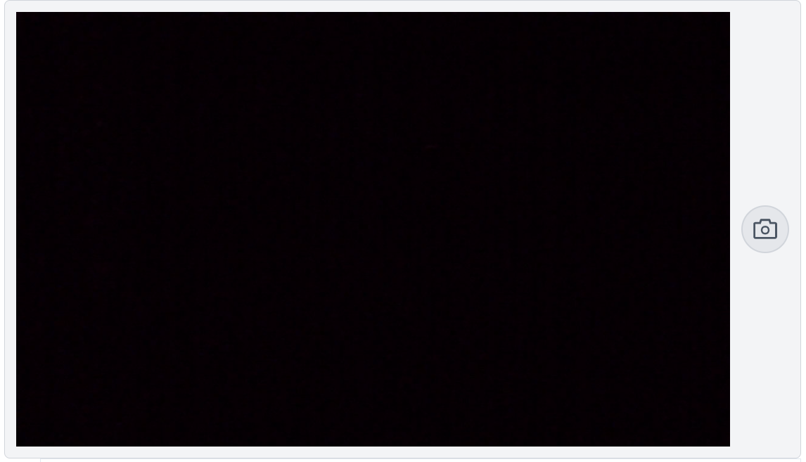

# Overview

React camera-pro component for Qodly studio

## Camera pro

React camera-pro component a versatile and advanced camera integration solution for React applications. It provides enhanced functionality for capturing and interacting with camera data.

## DataSource

| Name       | Type             | Description                                                       |
| ---------- | ---------------- | ----------------------------------------------------------------- |
| Datasource | Entity Selection | Entity Selection that serves as the source of data for component. |
